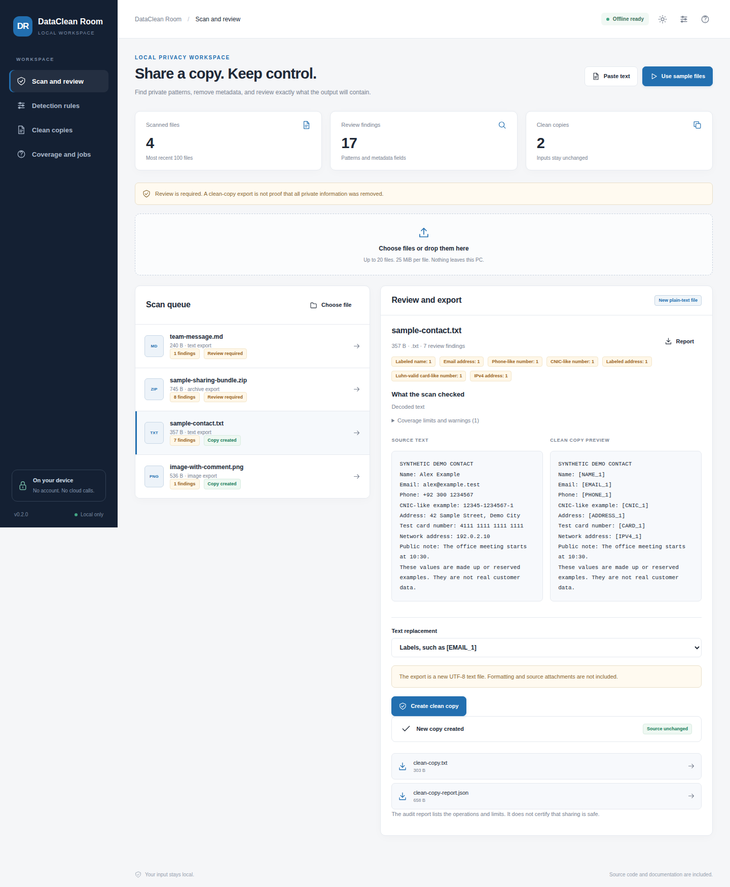
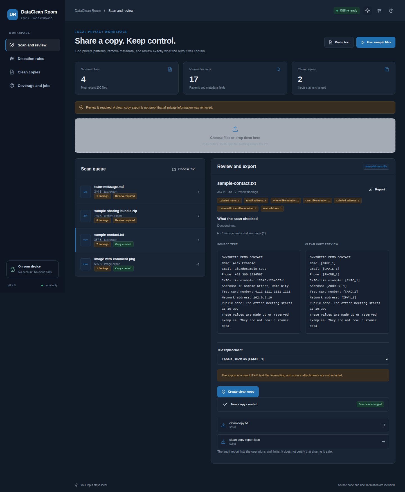

# DataClean Room

Review and clean private data before sharing files.

[](https://github.com/danial-maqbool/DataClean-Room/actions/workflows/tests.yml)


DataClean Room helps me check files for common private data, choose what to remove, and export a new clean copy. Processing stays local and the original file is kept unchanged.

## Main features

- Email, phone, ID, card, IP, and custom-value detection
- Local OCR for images and scanned PDFs
- OCR-tolerant custom-value matching with review warnings
- Raster-only PDF clean copies with source objects removed
- Image redaction with metadata removal
- DOCX, XLSX, and PPTX reconstruction
- Bounded ZIP cleaning with omission reports
- Encrypted local scan history

## Quick start

```bash
git clone https://github.com/danial-maqbool/DataClean-Room.git
cd DataClean-Room
```

**Windows**

```powershell
py -3 bootstrap.py
.\start.bat --demo
```

**Linux / macOS**

```bash
python3 bootstrap.py
sh start.sh --demo
```

OCR needs Tesseract installed locally. For normal use, start without `--demo`.

## Screenshots

<p align="center">
  
  
</p>

## Project layout

```text
app/        detection and cleaning logic
web/        local interface
localdesk/  local runtime, vault, OCR and jobs
examples/   sample files
tests/      automated tests
scripts/    verification tools
docs/       setup, design and test notes
```

## Notes

OCR and pattern matching can still miss private information. Every exported file should be reviewed before sharing, especially scans, handwriting, faces, and diagrams.

More details: [Setup](docs/SETUP.md) · [User guide](docs/USER_GUIDE.md) · [OCR matching](docs/OCR_REDACTION_FIX.md) · [Testing](docs/VERIFICATION.md) · [Security](SECURITY.md)

## License

MIT. See [LICENSE](LICENSE).
