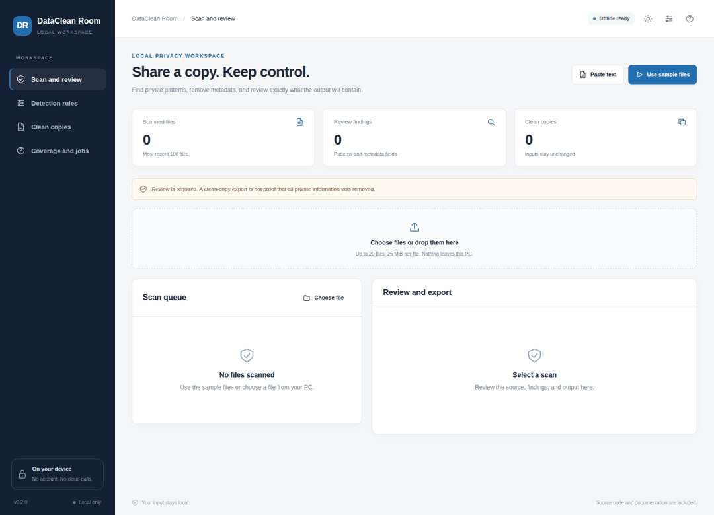
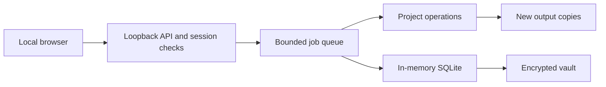

# DataClean Room

Review files before sharing them. Detect common private-data patterns, select what to remove, and create a new copy. Check the result before sending it to another person.

**Local processing. No API keys. No account. CPU operation. Encrypted application database.**

[](https://github.com/danial-maqbool/DataClean-Room/actions/workflows/tests.yml)




The recording uses synthetic examples in the working application. Frame timing is illustrative.

## What you can do

| Feature | Behavior |
| :--- | :--- |
| **Private-data patterns** | Find email, phone, identifier, card, IP, and custom literal matches. Review each match. |
| **Local OCR** | Inspect image and scanned-PDF text with local Tesseract. Keep review notes and word positions. |
| **PDF clean copies** | Replace selected regions in rendered pixels. Rebuild a PDF without original hidden objects. |
| **Image redaction** | Draw opaque regions over sensitive pixels. Export a new image without source metadata. |
| **Office clean copies** | Reconstruct supported DOCX, XLSX, and PPTX content. Remove comments, properties, and unsafe embedded content. |
| **Archive review** | Process bounded top-level ZIP entries. Report exclusions and use generic output names. |
| **Source protection** | Refuse exports after a source changes. Create new files and keep the input unchanged. |
| **Encrypted records** | Store scan records in an encrypted vault. Keep each export with an audit report. |

## Start on your PC

Install Python 3.11 or later. Download this repository or clone it:

```sh
git clone https://github.com/danial-maqbool/DataClean-Room.git
cd DataClean-Room
```

**Windows**

```powershell
py -3 bootstrap.py
.\start.bat
```

**Linux or macOS**

```sh
python3 bootstrap.py
sh start.sh
```

Setup creates a project-local `.venv`. The first normal start asks for a vault passphrase with at least 12 characters. Keep the passphrase. There is no password-reset server.

The application opens at `http://127.0.0.1:8765`. Try synthetic data without a persistent database:

```sh
# Windows
start.bat --demo

# Linux or macOS
sh start.sh --demo
```

The first package installation needs internet access or pre-downloaded wheels. Normal processing stays local. Install Tesseract and its local language data for OCR. RecoveryLab also uses FFmpeg and ffprobe for video recovery. Read [Setup](docs/SETUP.md) for OS instructions and offline installation.

## Daily use

Read the [user guide](docs/USER_GUIDE.md). Start with the included examples. Select your files only after checking the example outputs.

Closing the browser leaves the local Python process running. Press Ctrl+C in its terminal to stop it. A user-login service can keep selected background jobs running without an open terminal. Service installation is explicit and uses the OS credential store. See [Background operation](docs/BACKGROUND.md).

## Where your data goes

| Location | Contents |
| :--- | :--- |
| `.local-data/app.vault` | Authenticated encrypted database snapshot. |
| `.local-data/inbox/` | Files explicitly uploaded or pasted into the application. |
| `.local-data/exports/` | New outputs and reports. |
| OS credential store | Vault passphrase only after explicit service setup. |

SQLite works in memory. The application encrypts persistent database snapshots and database backups with AES-256-GCM. Source files, exported files, and parser temporary files are not encrypted by the application. Protect those files with OS disk encryption when needed.

## Design



```text
app/          Project operations and validation
localdesk/    Local HTTP, jobs, vault, OCR/PDF, and semantic components
web/          HTML, CSS, and JavaScript without external runtime assets
examples/     Synthetic input files
tests/        Unit, integration, and adversarial regression tests
scripts/      Browser checks and release verification
docs/         Setup, API, design, reports, and recorded media
```

Each repository contains its runtime source. No other repository is required after cloning. The shared runtime has a recorded source revision in [Runtime provenance](docs/RUNTIME.md).

## Verify a change

```sh
# Use .venv\Scripts\python.exe on Windows.
.venv/bin/python -m pip install -r requirements-dev.txt
.venv/bin/python scripts/verify.py
.venv/bin/python -m playwright install chromium
.venv/bin/python scripts/browser_check.py
```

The CI matrix runs on Windows, macOS, and Ubuntu with Python 3.11 and 3.13. Ubuntu also runs native-tool integration tests and a direct-navigation browser check. Reports list every skipped test. Read [Verification](docs/VERIFICATION.md) before drawing conclusions from a test count.

## Processing boundaries

Pattern detection and OCR can miss private information. Reconstructed Office copies can change formatting. PDF pixel reconstruction removes selectable text and original interactive features. Review faces, handwriting, diagrams, and every output page before sharing.

Passing tests does not prove that all inputs or computers work. Read [Security](SECURITY.md) and [Processing boundaries](docs/LIMITS.md).

## Documentation

[User guide](docs/USER_GUIDE.md) · [Setup](docs/SETUP.md) · [API](docs/API.md) · [Architecture](docs/ARCHITECTURE.md) · [Verification](docs/VERIFICATION.md) · [Contributing](CONTRIBUTING.md)

## License

MIT. See [LICENSE](LICENSE). External tools and model weights keep their own licenses. See [Sources](docs/SOURCES.md).
